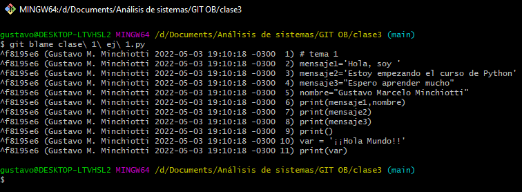
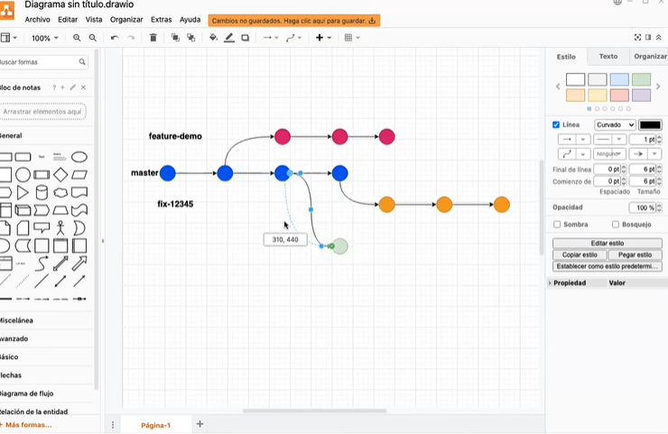
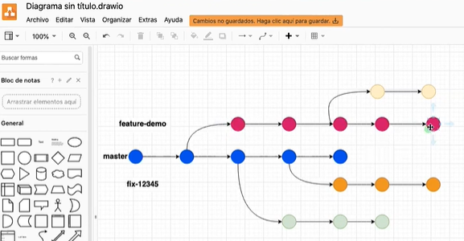
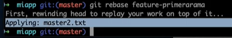
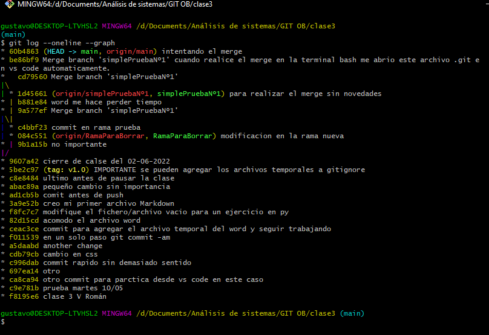

# Clase 4 OB
## Esquema control de versiones
### Utilización de **SOFT reset**
Inicialmente explica a través de varios commits como van avanzando los proyectos y que los últimos cambios van a ser donde se posiciona el **head** o cabezal es donde estamos trabajando.
Para cambiar la posición del **head** una de las herramientas es el comando ***git reset --soft*** se utiliza de la siguiente manera: ***git reset --soft*** + ***head*** + ***~*** + ***3*** // *3 es solo un ejemplo representa el número de posiciones hacia atrás que quiero volver o deshacer*, esto último lo determino con ***git log***.
No se borraron los archivos, pero SI volvió hacia atrás.

### Utilización de **HARD reset**
La diferencia principal es que al volver hacia un punto de restauración anterior borra lo que no reconoce. **Sintaxis:**  ***git reset --hard*** + ***head*** + ***~*** + ***número hacia atrás desde el head.***
También se puede utilizar en el mismo head para borrar todo lo que no este commiteado hasta el momento.

### Que es git diff

Esta herramienta nos muestra los cambios entre nuestra copia de trabajo y nuestro repo local, sería para un caso en que no sepamos que cambios hicimos antes de hacer un commit.
**Sintaxis:** ***git diff***

### Utilización de git bisect
Sirve para saber que commit ha podido romper algo, a lo largo de varios commits puedo decir hasta cuál estaba todo funcionando bien y cuando comenzó a funcionar mal.

What is git bisect command?
git bisect help. This command uses a binary search algorithm to find which commit in your project's history introduced a bug. You use it by first telling it a "bad" commit that is known to contain the bug, and a "good" commit that is known to be before the bug was introduced.

https://git-scm.com/docs/git-bisect/2.1.4  **Documentation**

https://stackoverflow.com/questions/4713088/how-to-use-git-bisect **Explicación**

### Git blame

Nos dice quien ha hecho que. **Sintaxis:** ***git blame + nombre de archivo a revisar***

En este ejemplo muestra quien en que fecha / hora y cuál fue el cambio realizado.

### Ramas

Todo lo visto en esta parte esta en clase 3, combinado con It.

**Sintaxis utilizada:** ***git branch, git checkout + nombre***

**Para crear y moverse a una nueva rama en una sola acción:** ***git checkout -b***

**Importante** ver desde donde creamos las ramas, no es igual desde master que desde una rama cualquiera. Las ramas heredan los comentarios de su rama anterior.

#### Crear una rama a partir de un commit previo y a partir de otra rama

**Sintaxis utilizada:** ***git branch + nombre de la nueva rama + el punto de restauración***  
> ejemplo: git branch ramaNueva 7127c60
> 

### Cómo trabajar con los remotos

Traer desde un repo remoto por ejemplo GitHub una rama para trabajar en ella. **Sintaxis utilizada:** ***git pull origin + nombre de la rama*** Y a continuación pasar a esa rama con ***git checkout + nombre de la rama***

### Unificar ramas, branching and merging

En un entrono corporativo es más frecuente utilizar ***git merge*** y en uno local o propio es frecuente utilizar ***git rebase*** ambos son similares en concepto pero diferentes en operación 

### Git merge 

Para fusionar debo primero situar el head en la rama a la cual quiero traer los cambios, **sintaxis:** ***git merge + rama que quiero fusionar*** si no hay conflictos va a ser un *fast forward* si la rama master avanzo aunque sea en un commit el merge va a pasar a ser "recursivo"   

### Git rebase

Funciona similar a *merge* la gran diferencia se basa en que para no ver una gran cantidad de commits en el log con *rebase* se reescribe el historial de confirmaciones (va hacia atrás) también o sea se modifica y simplifica el log.
**Sintaxis:** ***git rebase + nombre de la rama que traigo para fusionar*** 

El cambio se vería asi, el mensaje que fue hacia atrás y luego los cambios que realizó. El histórico se vuelve lineal la rama **NO** desaparece al ser integrada, pero salvo que vuelva a hacer modificaciones dentro de ella no se muestra.

En este ejemplo de la otra carpeta me muestra las ramas de manera gráfica. **sintaxis:** ***git log --oneline --graph***

## Es interesante ver como trabajar Markdown en VsCode o IntelliJ crea carpetas distintas y trabaja de otra manera los archivos.

**Creé un repo en GitHub desde dentro de PyCharm tardé unos minutos, pero lo hice simplemente usando la documentación en línea de IntelliJ**

### Git stash

Git stash es "el modo no molestar" crea una especie de carpeta/directorio paralelo al trabajo que estábamos haciendo si tenemos que dedicarnos a otra parte del proyecto de manera urgente, otro ejemplo es como si los cambios que estábamos trabajando en ese momento se guardan en un cajon y seguimos con el nuevo pedido.
Todo esto en palabras de Victor. 

GUARDAR FRAGMENTOS

Almacena y restaura cambios incompletos

* **git stash**
Almacena temporalmente todos los archivos tracked modificados
* **git stash list**
Enumera todos los sets de cambios en guardado rápido
* **git stash pop**
Restaura los archivos guardados más recientemente
* **git stash drop**
Elimina el set de cambios en guardado rápido más reciente
