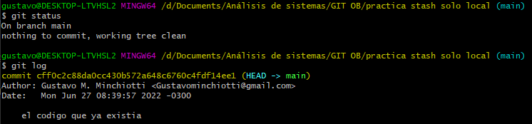

# Clase 4 OB
## Esquema control de versiones
### Utilización de **SOFT reset**
Inicialmente explica a través de varios commits como van avanzando los proyectos y que los últimos cambios van a ser donde se posiciona el **head** o cabezal es donde estamos trabajando.
Para cambiar la posición del **head** una de las herramientas es el comando ***git reset --soft*** se utiliza de la siguiente manera: ***git reset --soft*** + ***head*** + ***~*** + ***3*** // *3 es solo un ejemplo representa el número de posiciones hacia atrás que quiero volver o deshacer*, esto último lo determino con ***git log***.
No se borraron los archivos, pero SI volvió hacia atrás. 

Ejemplo real donde me equivoqué:

Volví un lugar atrás. 

### Utilización de **HARD reset**
La diferencia principal es que al volver hacia un punto de restauración anterior borra lo que no reconoce. **Sintaxis:**  ***git reset --hard*** + ***head*** + ***~*** + ***número hacia atrás desde el head.***
También se puede utilizar en el mismo head para borrar todo lo que no este commiteado hasta el momento.

### Que es git diff

Esta herramienta nos muestra los cambios entre nuestra copia de trabajo y nuestro repo local, sería para un caso en que no sepamos que cambios hicimos antes de hacer un commit.
**Sintaxis:** ***git diff***

### Utilización de git bisect
Sirve para saber que commit ha podido romper algo, a lo largo de varios commits puedo decir hasta cuál estaba todo funcionando bien y cuando comenzó a funcionar mal.

What is git bisect command?
git bisect help. This command uses a binary search algorithm to find which commit in your project's history introduced a bug. You use it by first telling it a "bad" commit that is known to contain the bug, and a "good" commit that is known to be before the bug was introduced.

https://git-scm.com/docs/git-bisect/2.1.4  **Documentation**

https://stackoverflow.com/questions/4713088/how-to-use-git-bisect **Explicación**

### Git blame

Nos dice quien ha hecho que. **Sintaxis:** ***git blame + nombre de archivo a revisar***

En este ejemplo muestra quien en que fecha / hora y cuál fue el cambio realizado.

### Ramas

Todo lo visto en esta parte esta en clase 3, combinado con It.

**Sintaxis utilizada:** ***git branch, git checkout + nombre***

**Para crear y moverse a una nueva rama en una sola acción:** ***git checkout -b***

**Importante** ver desde donde creamos las ramas, no es igual desde master que desde una rama cualquiera. Las ramas heredan los comentarios de su rama anterior.

#### Crear una rama a partir de un commit previo y a partir de otra rama

**Sintaxis utilizada:** ***git branch + nombre de la nueva rama + el punto de restauración***  
> ejemplo: git branch ramaNueva 7127c60
> 

### Cómo trabajar con los remotos

Traer desde un repo remoto por ejemplo GitHub una rama para trabajar en ella. **Sintaxis utilizada:** ***git pull origin + nombre de la rama*** Y a continuación pasar a esa rama con ***git checkout + nombre de la rama***

### Unificar ramas, branching and merging

En un entrono corporativo es más frecuente utilizar ***git merge*** y en uno local o propio es frecuente utilizar ***git rebase*** ambos son similares en concepto pero diferentes en operación 

### Git merge 

Para fusionar debo primero situar el head en la rama a la cual quiero traer los cambios, **sintaxis:** ***git merge + rama que quiero fusionar*** si no hay conflictos va a ser un *fast forward* si la rama master avanzo aunque sea en un commit el merge va a pasar a ser "recursivo"   

### Git rebase

Funciona similar a *merge* la gran diferencia se basa en que para no ver una gran cantidad de commits en el log con *rebase* se reescribe el historial de confirmaciones (va hacia atrás) también o sea se modifica y simplifica el log.
**Sintaxis:** ***git rebase + nombre de la rama que traigo para fusionar*** 

El cambio se vería asi, el mensaje que fue hacia atrás y luego los cambios que realizó. El histórico se vuelve lineal la rama **NO** desaparece al ser integrada, pero salvo que vuelva a hacer modificaciones dentro de ella no se muestra.

En este ejemplo de la otra carpeta me muestra las ramas de manera gráfica. **sintaxis:** ***git log --oneline --graph***

## Es interesante ver como trabajar Markdown en VsCode o IntelliJ crea carpetas distintas y trabaja de otra manera los archivos.

**Creé un repo en GitHub desde dentro de PyCharm tardé unos minutos, pero lo hice simplemente usando la documentación en línea de IntelliJ**

### Git stash

Git stash es "el modo no molestar" crea una especie de carpeta/directorio paralelo al trabajo que estábamos haciendo si tenemos que dedicarnos a otra parte del proyecto de manera urgente, otro ejemplo es como si los cambios que estábamos trabajando en ese momento se guardan en un cajon y seguimos con el nuevo pedido.
Todo esto en palabras de Victor. 

GUARDAR FRAGMENTOS

Almacena y restaura cambios incompletos

* **git stash**
Almacena temporalmente todos los archivos **tracked** modificados (*si no se hace add no funciona*)
* **git stash list**
Enumera todos los sets de cambios en guardado rápido
* **git stash pop**
Restaura los archivos guardados más recientemente
* **git stash drop**
Elimina el set de cambios en guardado rápido más reciente

Con la creación de los nuevos txt representaba que estaba trabajando en algo y tuve que cambiar a otra tarea **AHÍ** es donde entra ***git stash***
y puedo ver que están como en un limbo no se borraron, pero no figuran para hacer *commit*. **MUY IMPORTANTE** En windows funciona solo si están en **stage** o sea que fue hecho el **add**

 

Existen, pero están en estado **Untracked** tampoco se ven en la carpeta.

>Ahora hago el supuesto trabajo urgente "Urgente.txt" luego su commit y vuelvo para recuperar lo subido a stash.

Para recuperar los archivos en los que estaba trabajando utilizo el comando ***git stash apply*** de esta manera los puedo visualizar tanto en la terminal git como en la carpeta.
Mientras en el commits no hay ningún error ni rama no deseada.

>Por último agrego al commit los archivos de stash y compruebo que no generó errores en el log nada se perdió.

### Cherry-Pick

En lugar de fusionar ramas enteras Voy a fusionar commits completos, un ejemplo es cuando se aplica un parche, puedo ir hacia atrás y solo agregar eso sin modificar las otras ramas completas.

La ejecución de cherry-pick es el acto de elegir una confirmación de una rama y aplicarla a otra.

*Por ejemplo, si una confirmación se aplica en la rama equivocada. Puedes cambiar a la rama correcta y ejecutar cherry-pick 
en la confirmación para aplicarla a donde debería estar.* **Más simple: toma el cambio que yo le indico y lo mete en mi rama actual**

>Sintaxis: **git cherry-pick adf46ef**  *(git cherry-pick + commit-SHA = **el número corto de git log --oneline**)* 
> 
> Para seleccionar un rango de cambios: *git cherry-pick + cff0c2c^..adf46ef* (Se lee, 1er commit del rango + ^.. + ultimo 
> del rango, en este caso los extremos son incluidos, SIN ESPACIOS)
> 
> Para un rango, pero sin los extremos sacamos el ^ quedaría: *git cherry-pick + cff0c2c..adf46ef*

### Workflow habitual trabajando con git

Forma standard de trabajar en GIT (la que usa Victor) Update -> change -> review -> commit

**Update** comienzo con un ***git pull*** o ***git fetch*** si estoy trabajando en un repositorio remoto para traer el trabajo y ver si hubo cambios y cuáles fueron

**Change** hago mi trabajo en el o los archivos. 

**Review** verifico con ***git diff*** por ejemplo

**Commit** guardo los cambios ***git commit*** 

### Forking workflow mas GIT CLONE

Trabajando fuera de mi stage local, Voy a clonar un repositorio remoto, haré mis cambios y solicitaré permiso al 
dueño/autor del repo que acepte los cambios.

_Ejemplo de trabajo:_ hago un fork de un repositorio para clonarlo.

En el repositorio clonado puedo trabajar libremente. Para obtenerlo o bajarlo copio la url y mediante ***git clone*** lo descargo en local. 

>Creé una carpeta inicialicé una terminal y cloné los ej, resueltos de OB.

### Alterar el comportamiento de git, hooks

Git hooks are scripts that run automatically every time a particular event occurs in a Git repository. They let you customize 
Git’s internal behavior and trigger customizable actions at key points in the development life cycle.
All Git hooks are ordinary scripts that Git executes when certain events occur in the repository. This makes them very easy to install and configure.

Hooks can reside in either local or server-side repositories, and they are only executed in response to actions in that repository.

>https://www.atlassian.com/git/tutorials/git-hooks

Un ejemplo sencillo es el hook de pre commit, si intento nombrar a un archivo con caracteres no ascii me da un error y advertencia

### Scripts en server-side

Server-side Hooks
Server-side hooks work just like local ones, except they reside in server-side repositories (e.g., a central repository, 
or a developer’s public repository). When attached to the official repository, some of these can serve as a way to enforce policy by rejecting certain commits.

There are 3 server-side hooks that we’ll be discussing in the rest of this article:

* pre-receive
* update
* post-receive

All of these hooks let you react to different stages of the git push process.

### Mandar notificaciones por Email
Lo realiza como un script server side dentro de git config. (*al ser server side solo será ejecutado cuando haga un push*)

Abrí en block de notas el archivo config de .git y lo modifiqué agregando: 
> [hooks]
	mailinglist = "gustavominchiotti@gamil.com"

No funcionó porque él había creado un repo y su hook desde un servidor y en mi caso estaba trabajando en local ver ese 
error más adelante.
